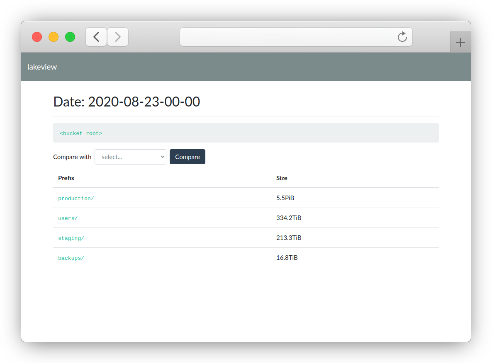
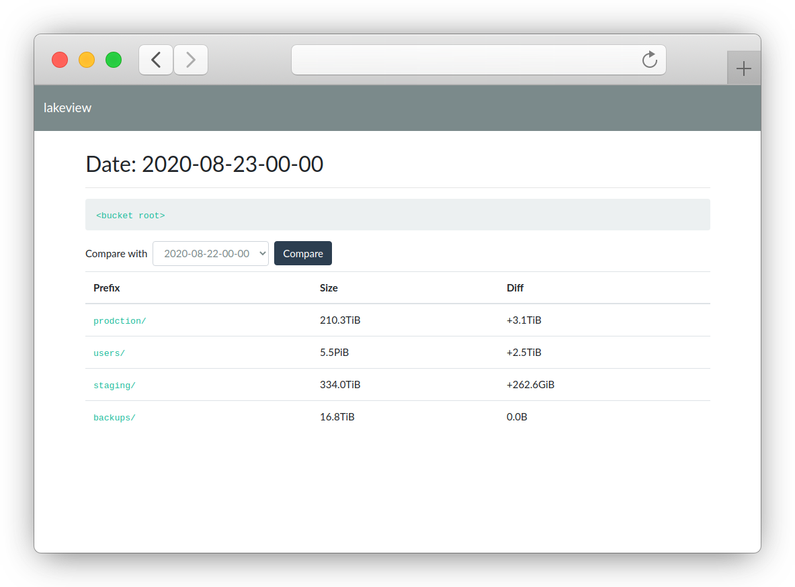

# lakeview

lakeview is a visibility tool for AWS S3 based data lakes.

Think of it as [ncdu](https://en.wikipedia.org/wiki/Ncdu), but for Petabyte-scale data, on S3.

Instead of scanning billions of objects using the S3 API (which would require millions of API calls),
lakeview uses [Athena](https://aws.amazon.com/athena/) to query [S3 Inventory Reports](https://docs.aws.amazon.com/AmazonS3/latest/dev/storage-inventory.html).

## What can it do?

1. Aggregate the sizes of directories* in S3, allowing you to drill down and find what is taking up space.
1. Compare sizes between different dates - see how directories size change over time between different inventory reports.
1. _Planned but not yet implemented - _ find the largest duplicates in your directories.


\* _S3, being an object store and not a filesystem, doesn't really have a notion of directories, but its API supports so-called "common prefixes"._

All capabilities are provided in both a human consumable web interface and a machine consumable JSON report - feel free to plug them into your favorite monitoring tool.

## What does it look like?

#### Size report:

<p align="center">
  
</p>


#### Size diff:

<p align="center">
  
</p>


## Quickstart

1. Ensure you have an [S3 inventory set up](https://docs.aws.amazon.com/AmazonS3/latest/dev/storage-inventory.html#storage-inventory-how-to-set-up) (preferably as Parquet or ORC)
1. Verify the table is [registered in Athena](https://docs.aws.amazon.com/AmazonS3/latest/dev/storage-inventory.html#storage-inventory-athena-query)
1. Run lakeview as a standalone Docker container:
   
   ```shell script
   docker run -it -p 5000:5000 \
       -v $HOME/.aws:/home/lakeview/.aws \
       treeverse/lakeview \
           --table <athena table name> \
           --output-location <s3 uri>
   ```
   
   note `<athena table name>` is the name you gave in step 2, and `<s3 uri>` is a location in S3 where Athena could store its results (e.g. `s3://my-bucket/athena/`)

   In the following example we are using [aws-vault](https://github.com/99designs/aws-vault) to pass in the AWS credentials:

  ```shell script
  awv docker run -it --rm -p 5555:5000 \
        -e AWS_DEFAULT_REGION -e AWS_ACCESS_KEY_ID -e AWS_SECRET_ACCESS_KEY -e AWS_SESSION_TOKEN -e AWS_SECURITY_TOKEN \
        treeverse/lakeview \
          --table <athena table name> \
          --output-location <s3 uri>
  ```

  where `awv` is an alias in your ~/.bashrc or ~/.zshrc file:

  ```
  alias awv="aws-vault exec <username> --duration=4h -- "
  ```
   
1. Open [http://localhost:5000/](http://localhost:5000/) and start exploring

## Using lakeview as an API


### API endpoint: `/du`

To get results as JSON - add `Accept: application/json` to your request headers, or pass `json` as a query string parameter.

#### Query Parameters: 

`prefix (default: "")` - return objects and directories[1] starting with the given prefix

`delimiter (default: "/")` - use this character as delimiter to group objects under a common prefix

`date` - date string corresponding to the inventory you'd like to query (YYYY-MM-DD-00-00) is S3's default structure

`compare (optional)` - another date string. If present, lakeview will calculate a diff between the two reports for every common prefix and will sort the results based on the largest absolute diff

#### Example

Request:

```
http://localhost:5000/du?prefix=&delimiter=%2F&date=2020-08-23-00-00&compare=2020-08-22-00-00&json
```

Response:

```json
{
  "compare": "2020-08-22-00-00",
  "date": "2020-08-23-00-00",
  "delimiter": "/",
  "prefix": "",
  "response": [
    {
      "common_prefix": "users/",
      "diff": 3363690400953,
      "size_left": 231203538669496,
      "size_right": 231203538669496
    },
    {
      "common_prefix": "production/",
      "diff": 2737293183914,
      "size_left": 6238586023266733,
      "size_right": 6238586023266733
    },
    {
      "common_prefix": "staging/",
      "diff": 281953288549,
      "size_left": 367219795944457,
      "size_right": 367219795944457
    },
    ...
  ]
}

```

## Building and running locally

Clone the repo, and from the root directory run:

```
$ pip install -r requirements.txt
```

and run this:

```
$ python server.py \
      --table <athena table name> \
      --output-location <s3 uri>
```

For a complete reference, run:

```
$ python server.py --help
```

## License

lakeview is distributed under the Apache 2.0 license. See the included LICENSE file.


## More information

lakeview was originally built (with <3) by [Treeverse](https://lakefs.io/).

We're actively developing [lakeFS](https://github.com/treeverse/lakeFS) as an open source tool that delivers resilience and manageability to object-storage based data lakes.
